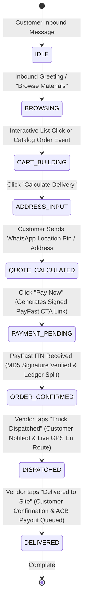
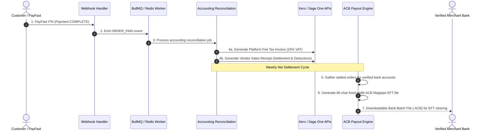

# WhatsAppEezy (`whatsappeezy.com`) — Multi-Tenant WhatsApp Commerce, Gemini AI Catalog Studio & PayFast MoR Engine

The official **WhatsAppEezy.com** South African WhatsApp Commerce & Merchant-of-Record (MoR) Platform built in **Node.js (TypeScript)** & **Next.js 14**, featuring:
1. **On-The-Spot Gemini Flash AI Photo Studio (`1024×1024 #F8F9FA`) & Meta Catalog Sync** (`src/services/image/`, `src/services/vision/`, `dashboard/components/upload-product-modal.tsx`)
2. **Zero-App WhatsApp Conversational Checkout, PostGIS GPS Delivery Pricing & 100% Verified PayFast MoR ITN Split** (`src/services/state-machine/`, `src/services/payment/`, `src/services/ledger/`)
3. **Multi-Vertical Merchant Command Portal, Kitchen Order Tickets (KOT), SABS Tipper Waybills & Weekly Friday Bank EFT Payouts** (`dashboard/app/page.tsx`, `dashboard/app/website/page.tsx`, `public/whatsappeezy-hostinger/index.html`)

---

## 🌟 System Architecture & Workflows

### 1. Conversational Commerce State Machine & Delivery Lifecycle


### 2. Automated Accounting & Weekly Payout Batching


---

## 🚀 Key Modules & Capabilities

### 1. Multi-Tenant Metrics Engine (`src/services/metrics/`)
Tracks live KPIs accessible via `GET /api/v1/dashboard/metrics` (filterable by tenant or platform-wide):
- **Gross Merchandise Value (GMV)**: Total gross sales volume across WhatsApp channels.
- **Net Commission Retained**: Platform margin accrued from facilitation commissions (e.g. 8.0%).
- **Successful Payment Conversions**: Conversion rate percentage ($\frac{\text{Successful Payments}}{\text{Total Checkouts Initiated}}$) and total completed transactions.
- **Delivery Fulfillment Status**: Real-time breakdown: `PENDING_DISPATCH`, `IN_TRANSIT`, `DELIVERED`, `CANCELLED`.
- **AI Query Resolution Rates**: Percentage of customer inquiries resolved automatically by the AI Vision and State Machine without human escalation.
- **Average Order Value (AOV)**.

### 2. Dedicated Xero Accounting Engine & Payouts (`src/services/accounting/xero-engine.service.ts`)
- **OAuth2 Token Storage & Auto-Refresh**: PostgreSQL / Redis OAuth2 token store with proactive automatic token refresh via official `xero-node` SDK.
- **Tenant Connection Lifecycle**: Manages active connection to the platform's single Xero Tenant (`XERO_TENANT_ID`).
- **Order Paid Event Automation (PayFast ITN Triggered)**:
  - **Vendor Contact Sync**: Checks or creates vendor Contact in Xero with full trading name, email, VAT registration number, mobile phone, and bank account details.
  - **Platform Fee Tax Invoice (`ACCREC`)**: Generates AUTHORISED sales invoice for platform facilitation commission with South African Standard 15% VAT on service fee (`AccountCode: 200`, `taxType: OUTPUT2`).
  - **Vendor Settlement Bill (`ACCPAY`)**: Generates AUTHORISED purchase bill for net vendor payout (`AccountCode: 400`, `taxType: NONE`), scheduled for the next batch settlement cycle.
- **Xero Batch Payment Generation**:
  - Endpoint `POST /api/accounting/xero/create-batch-payment` bundles all AUTHORISED unpaid vendor bills into a Xero Batch Payment file (`PAYBATCH`) linked to the platform bank account for one-click banking reconciliation.

### 3. Payout Batching & Automated End-of-Day Reconciliation (`src/services/payout/`, `src/services/cron/`)
- **Daily Scheduled Cron Task (00:00 SAST / `Africa/Johannesburg`)**:
  - Compiles all double-entry `ledger_entries` for the day.
  - Automatically aggregates approved vendor payouts and reconciles balances against verified bank accounts.
- **South African Online Banking CSV Bulk Payout Format**:
  - Generates RFC 4180 compliant CSV files accepted by major South African commercial banks (**FNB, Standard Bank, Nedbank, Absa**):
    `Recipient Name, Bank Name, Branch Code, Account Number, Account Type, Amount, Beneficiary Reference, Payer Reference, Status`
  - Downloadable via `GET /api/v1/payouts/batches/:batchId/csv`.
- **Automated Clearing Bureau (ACB) Magtape Format**:
  - Generates standard 80-character fixed-width Magtape EFT files (`02` User Header, `10` Credit Detail, `99` User Trailer).
  - Downloadable via `GET /api/v1/payouts/batches/:batchId/download`.
- **On-Demand EOD Reconciliation**: `POST /api/v1/payouts/reconciliation/eod`.

### 4. WhatsApp State Machine & Vendor Dispatch Flow (`src/services/state-machine/`)
Handles inbound Meta WhatsApp Cloud API webhooks (`GET /webhook` verification, `POST /webhook` events):
- `IDLE` -> `BROWSING` -> `CART_BUILDING` -> `ADDRESS_INPUT` -> `QUOTE_CALCULATED` -> `PAYMENT_PENDING` -> `ORDER_CONFIRMED`.
- **Vendor Dispatch State Machine (`NEW PAID DISPATCH` interactive alerts)**:
  - Button `dispatch_loaded`:
    - Updates `orders.current_status = 'dispatched'`.
    - Dispatches instant WhatsApp ping to customer: `"🚚 Your order is on the truck and out for site delivery! Driver is en route."`
  - Button `dispatch_delivered`:
    - Updates `orders.current_status = 'delivered'`.
    - Dispatches instant WhatsApp confirmation to customer: `"✅ Delivery completed. Please inspect materials and let us know if everything is in order."`

### 5. PostGIS Geofencing, Real-Time Delivery Distance & Freight Surcharges (`src/services/delivery/`)
- **PostGIS Spatial Geofencing (`check_vendor_delivery_radius`)**:
  - Automatically queries vendor yard `base_location` against incoming customer GPS location pin (`EPSG:4326`).
  - Evaluates vendor's `max_delivery_radius_km` (e.g., 45.0 km).
  - If customer pin exceeds delivery zone: dispatches an interactive WhatsApp response alerting the customer and provides interactive actions:
    - `[📍 Send New Location]` (`btn_change_location`)
    - `[💬 Speak to Agent]` (`btn_speak_agent` - connects to logistics dispatch desk)
    - `[❌ Cancel Order]` (`btn_cancel_quote`)
- **Google Distance Matrix Road Haulage Calculation**:
  - Calculates real road driving distance and travel duration from vendor quarry/depot to site.
  - Dynamically calculates freight fee:
    $$\text{Delivery Fee} = \text{Base Delivery Fee} + (\text{Distance (km)} \times \text{Per-KM Rate}) + \text{Heavy Tipper Surcharge}$$
- **Aggregated Load & Heavy Tipper Surcharge**:
  - Automatically calculates total aggregated cubic meters ($m^3$) across bulk materials (plaster/building sand tippers, maxi bricks, pallets of cement).
  - Loads $\le 6m^3$: standard tipper dispatch without surcharge ($R0.00$).
  - Loads $> 6m^3$: heavy tipper mobilization surcharge of $R250.00$ base $+ R75.00/m^3$ for every $m^3$ in excess of $6m^3$.
- **PostgreSQL Draft Order Persistence & Interactive Quote**:
  - Persists draft order in PostgreSQL `orders` table with status `pending_payment`, `delivery_point` geometry, `distance_km`, `subtotal`, `delivery_fee`, and `total_amount`.
  - Dispatches itemized Quote Summary message with interactive buttons:
    `[Accept & Pay (Instant)]` (`btn_pay_now`) | `[Change Quantity]` (`btn_modify_qty`) | `[Cancel Order]` (`btn_cancel_quote`).

### 6. PayFast Split-Checkout & ITN Handler (`src/services/payment/`)
- Generates dynamic signed PayFast checkout URLs with MD5 hashing and passphrase.
- Dispatches in-chat WhatsApp Interactive CTA buttons (`"Pay Securely Now"`).
- Verifies incoming ITN postbacks and settles vendor net payout:
  $$\text{Vendor Net} = \text{Gross Amount} - \text{Platform Commission (8\%)} - \text{PayFast Fee}$$
- Dispatches automated payment receipts to customer lines and pick lists to vendor lines.

### 7. Live WhatsApp Supplier Image Upload & Vision AI Engine (`src/services/vendor/`)
- **Direct Vendor WhatsApp Intake**:
  - Automatically identifies verified registered vendor lines (`vendors.whatsapp_number`).
  - Intercepts inbound WhatsApp media (`type == 'image'`), queries Meta Graph API `GET /{media_id}` with Bearer Token, and downloads raw binary buffer.
- **AI Vision & Specification Extraction (GPT-4o / Claude Vision)**:
  - Extracts structured schema: `title`, `category` (`sand_stone`, `bricks_blocks`, `cement`, `aluminium`, `hardware`), `unit_of_measure` (`per m3`, `per 1000 bricks`, `per bag`, `per unit`), `unit_price`, and `description`.
  - Prioritizes user caption pricing overrides (e.g. `"R580 per cube"`) over AI default estimates.
- **Sharp.js Normalization Pipeline**:
  - Fits photo into a 1024x1024 square canvas with `#F8F9FA` padding, Lanczos3 resampling, auto-orientation (`.rotate()`), and bottom pill banner overlay.
  - Compresses to WebP / JPEG under 500KB and uploads to Cloudinary CDN.
- **Database Draft & Meta Commerce Catalog Push**:
  - Saves product draft in PostgreSQL `products` table.
  - Sends interactive WhatsApp preview back to vendor with image header and quick reply buttons:
    `[Approve & Publish]` | `[Edit Price]` | `[Discard]`.
  - Upon approval, immediately pushes product to Meta Catalog (`POST /v19.0/{catalog_id}/products`) with retailer ID, public image CDN URL, and price in ZAR cents.

### 8. PostgreSQL + PostGIS Schema & Double-Entry Escrow Ledger (`migrations/001_initial_schema.sql`)
- **Extensions**: `uuid-ossp` and `postgis`.
- **Spatial Geometry**:
  - `vendors.base_location` (`GEOGRAPHY(Point, 4326)`) indexed with GIST (`idx_vendors_location`).
  - `orders.delivery_point` (`GEOGRAPHY(Point, 4326)`).
  - Spatial stored function `check_vendor_delivery_radius(p_vendor_id, p_customer_lon, p_customer_lat)` returning `within_radius` boolean and `distance_km`.
- **Double-Entry Financial Escrow Ledger (`ledger_entries`)**:
  - Entry types: `customer_payment_received`, `platform_commission_earned`, `payment_spread_retained`, `gateway_fee_disbursed`, `vendor_payout_disbursed`, `saas_subscription_setoff`, `gateway_fee_deducted`, `refund_reversed`.
  - Atomically calculates debit, credit, and running balance (`balance_after`) per vendor.
- **Migration CLI**: Apply schema via `npm run migrate`.

### 9. Multi-Tenant Revenue Engine & PayFast MoR Fee Arbitrage (`src/services/revenue/`)
> 📄 See [ARCHITECTURE_AND_REVENUE_SPEC.md](./ARCHITECTURE_AND_REVENUE_SPEC.md) for the complete mathematical specification, zero-leakage accounting identity, and ledger schema reference.

- **Subscription Tier Presets (`starter` | `pro` | `enterprise`)**:
  - Tracks recurring monthly SaaS fees (`R299`, `R599`, `R999`/mo), take-rate commissions (`5%`–`8%`), `processing_fee_billed_rate` (e.g., `2.9% + R2.00`), and `processing_fee_actual_cost` (e.g., `2.0% + R1.50` wholesale master PayFast rate).
- **Merchant-of-Record (MoR) Interchange Arbitrage**:
  - Isolates `platform_commission`, `payment_fee_charged`, `payment_fee_actual`, `gateway_margin_spread`, `net_vendor_payout`, and `total_platform_yield`.
  - Records all 5 settlement components (`customer_payment_received`, `platform_commission_earned`, `payment_spread_retained`, `gateway_fee_disbursed`, `vendor_payout_disbursed`) atomically on PayFast ITN completion.
- **Monthly SaaS Subscription Billing & Automated Ledger Set-Off**:
  - Deducts monthly SaaS subscription fees (`saas_subscription_setoff`) directly from unsettled vendor order balances prior to releasing weekly bank EFT payouts, with fallback to PayFast tokenized ad-hoc charges or Xero recurring tax invoices (`ACCREC`).

---

## 🛠️ Configuration & Setup

### 1. Environment Variables (`.env`)
```env
PORT=3000
NODE_ENV=development

# WhatsApp Business Cloud API
WHATSAPP_PHONE_NUMBER_ID=your_phone_number_id
WHATSAPP_ACCESS_TOKEN=your_whatsapp_cloud_api_token
WHATSAPP_VERIFY_TOKEN=cargodash-secure-webhook-token
META_WEBHOOK_VERIFY_TOKEN=cargodash-secure-webhook-token
META_APP_SECRET=your_meta_app_secret
WHATSAPP_BUSINESS_ACCOUNT_ID=your_waba_id

# Distance & Delivery
GOOGLE_MAPS_API_KEY=your_google_maps_api_key
VENDOR_DEFAULT_LAT=-26.2041
VENDOR_DEFAULT_LNG=28.0473
VENDOR_DEFAULT_WHATSAPP_NUMBER=27820000001

# PayFast Split-Checkout
PAYFAST_MERCHANT_ID=10000100
PAYFAST_MERCHANT_KEY=46f0cd694581a
PAYFAST_PASSPHRASE=payfast_secure_passphrase
PAYFAST_ENV=sandbox
PAYFAST_RETURN_URL=https://cargodash.com/checkout/success
PAYFAST_CANCEL_URL=https://cargodash.com/checkout/cancelled
PAYFAST_NOTIFY_URL=https://api.cargodash.com/api/v1/payments/payfast/itn
PLATFORM_COMMISSION_PERCENTAGE=8.0

# Accounting Integrations
XERO_ACCESS_TOKEN=your_xero_token
XERO_TENANT_ID=your_xero_tenant_id
SAGE_ONE_API_KEY=your_sage_key
SAGE_ONE_USERNAME=your_sage_user
SAGE_ONE_PASSWORD=your_sage_password

# Background Queue (Railway Redis)
REDIS_URL=redis://localhost:6379
REDIS_HOST=localhost
REDIS_PORT=6379

# Cloudinary
CLOUDINARY_CLOUD_NAME=your_cloud_name
CLOUDINARY_API_KEY=your_api_key
CLOUDINARY_API_SECRET=your_api_secret

# AI Vision Provider ('openai' or 'anthropic')
VISION_PROVIDER=openai
OPENAI_API_KEY=sk-proj-...

# Meta Commerce Manager Catalog
META_CATALOG_ID=your_catalog_id
META_ACCESS_TOKEN=your_meta_system_user_token

# Mock mode (safe local testing without live API keys)
MOCK_EXTERNAL_APIS=true
```

---

## 🧪 Testing & Execution

### Run All 22 Automated Test Suites (128 Tests)
```bash
npm test
```
```
 ✓ tests/sharp.service.test.ts (2 tests)
 ✓ tests/postgres-schema.test.ts (5 tests)
 ✓ tests/freight-delivery.test.ts (4 tests)
 ✓ tests/accounting-reconciliation.test.ts (3 tests)
 ✓ tests/metrics.test.ts (3 tests)
 ✓ tests/orchestrator.test.ts (1 test)
 ✓ tests/cape-aggregator.test.ts (13 tests)
 ✓ tests/state-machine.test.ts (7 tests)
 ✓ tests/meta.service.test.ts (1 test)
 ✓ tests/vendor-product-ingestion.test.ts (7 tests)
 ✓ tests/vision.service.test.ts (2 tests)
 ✓ tests/fastify-webhook.test.ts (4 tests)
 ✓ tests/payout-batching.test.ts (5 tests)
 ✓ tests/payfast-itn-webhook.test.ts (5 tests)
 ✓ tests/http-api.test.ts (3 tests)
 ✓ tests/payfast.test.ts (3 tests)
 ✓ tests/geofence-freight.test.ts (9 tests)
 ✓ tests/supplier-delivery-accounting-sync.test.ts (6 tests)
 ✓ tests/xero-engine.test.ts (13 tests)
 ✓ tests/meta-cloud-webhook-handshake.test.ts (6 tests)
 ✓ tests/order-queue-worker.test.ts (20 tests)
 ✓ tests/mor-revenue-engine.test.ts (6 tests)

 Test Files  22 passed (22)
      Tests  128 passed (128)
```

### Simulating Live Supplier WhatsApp Image Ingestion & Catalog Push
```bash
# Run the end-to-end supplier upload, Vision AI extraction & catalog push test:
npx tsx scripts/test-vendor-image-ingest.ts
```

### Simulating PayFast ITN Webhook via Curl / PowerShell
```bash
# Bash (Linux / macOS / Git Bash)
./scripts/test-payfast-itn.sh http://localhost:3001/api/webhooks/payfast/itn

# PowerShell (Windows)
pwsh ./scripts/test-payfast-itn.ps1 -WebhookUrl "http://localhost:3001/api/webhooks/payfast/itn"
```

### Start Fastify Webhook, Dashboard & Payout Server
```bash
npm run dev:webhook
# or production:
npm run start:webhook
```

### Start Express Supplier Ingestion Service
```bash
npm run dev
# or production:
npm run start
```

### Start Next.js 14 Vendor Admin Dashboard UI (Port 3002)
```bash
npm run dev:dashboard
# or production build & start:
npm run build:dashboard
npm --prefix dashboard start
```
- Open [http://localhost:3002](http://localhost:3002) to access the industrial dispatch & stock management UI.
- Direct driver waybill printing: [http://localhost:3002/waybill/ORD-2026-8921](http://localhost:3002/waybill/ORD-2026-8921).

---

## 📡 API Endpoints Reference

### Dashboard & Metrics
- `GET /api/v1/dashboard/metrics`: Live KPIs (GMV, net commission, conversion rate, fulfillment status, AI query resolution). Accepts optional `?tenant_id=...` and `?period=...`.
- `GET /api/v1/dashboard/tenants`: List registered merchants with verified bank accounts.

### Multi-Tenant Revenue Engine & SaaS Subscriptions
- `POST /api/v1/revenue/calculate-settlement`: Calculate or preview order MoR fee arbitrage settlement breakdown.
- `PATCH /api/v1/revenue/vendors/:vendorId/tier`: Configure vendor subscription tier (`starter` | `pro` | `enterprise`), commission rate, and billed/actual processing fee rates.
- `POST /api/v1/revenue/subscriptions/bill-vendor`: Execute monthly SaaS subscription billing & automated ledger set-off for a vendor.
- `POST /api/v1/revenue/subscriptions/run-cycle`: Execute monthly SaaS billing & ledger set-off cycle across all active vendors.

### Accounting & Reconciliation
- `POST /api/accounting/xero/create-batch-payment`: Gathers all AUTHORISED unpaid vendor bills for a given settlement cycle and bundles them into a Xero Batch Payment (`PAYBATCH`) for one-click banking reconciliation.
- `POST /api/v1/accounting/xero/create-batch-payment`: API v1 alias for batch payment creation.
- `POST /api/accounting/xero/sync-order`: Trigger on-demand sync of order platform fee invoice (`ACCREC`) and vendor bill (`ACCPAY`) into Xero.
- `GET /api/accounting/xero/status`: Status of Xero OAuth2 connection, token validity, and synchronized records count.
- `GET /api/v1/accounting/invoices`: List platform commission tax invoices billed to suppliers.
- `GET /api/v1/accounting/receipts`: List vendor sales receipts reflecting customer settlements and deductions.

### Payout Batching & Bank EFTs
- `POST /api/v1/payouts/batches/generate`: Trigger net-weekly settlement batch compilation for verified bank accounts.
- `GET /api/v1/payouts/batches`: List generated payout batches.
- `GET /api/v1/payouts/batches/:batchId/download`: Download raw fixed-width South African ACB Magtape EFT file.

### WhatsApp Webhooks & Checkout
- `GET /api/webhooks/whatsapp` & `GET /webhook`: Meta challenge verification (`hub.mode`, `hub.verify_token`, `hub.challenge`).
- `POST /api/webhooks/whatsapp` & `POST /webhook`: Meta WhatsApp incoming events with `x-hub-signature-256` HMAC-SHA256 raw body verification and `<500ms` non-blocking queue ingestion.
- `POST /api/webhooks/payfast/itn`: PayFast Instant Transaction Notification (with MD5 signature verification, IP validation, server postback ping, and 5-component atomic double-entry ledger settlement).
- `POST /api/v1/payments/payfast/itn`: PayFast ITN alias endpoint.
- `GET /api/v1/ledger`: Query commission split ledger.
- `GET /api/v1/sessions/:waId`: Inspect customer session stage and active cart.

### Supplier Asset Ingestion
- `POST /api/v1/products/ingest`: Multipart image intake, Cloudinary AI background removal, Sharp 1024x1024 white canvas + corner branding, Vision AI attribute extraction, and Meta Commerce Catalog upsert (`POST /v19.0/{catalog_id}/products`).
- `GET /api/v1/products`: List ingested products and sync statuses.
- `GET /api/v1/products/:id`: Product details and WhatsApp catalog deep-link.
- `POST /api/v1/products/:id/resync`: Trigger manual Meta catalog re-sync.

