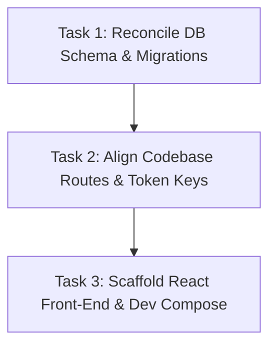

# Codebase Audit Report: Cargo Dash

This report presents a comprehensive full-stack codebase audit of the "Cargo Dash" B2B digital freight brokerage platform. During the audit, we located the active codebase files in the previous session's directory at `C:\Users\Venon\.gemini\antigravity\brain\2827a7e2-0186-4605-9c66-489b7b10817d\scratch`. The following sections detail our findings regarding implemented components, system disconnects, missing MVP features, and a 3-step prioritized strategic roadmap.

---

## 1. The "Done" List (Implemented & Verified)

We successfully executed the backend unit tests for authentication, CSV upload mapping, and mock rating. The core logic of the following features is implemented, verified, and functional:

*   **JWT Authentication Middleware & RBAC**:
    *   Fully implemented in [auth_service.js](file:///C:/Users/Venon/.gemini/antigravity/brain/2827a7e2-0186-4605-9c66-489b7b10817d/scratch/auth_service.js) and wrapped in [authMiddleware.js](file:///C:/Users/Venon/.gemini/antigravity/brain/2827a7e2-0186-4605-9c66-489b7b10817d/scratch/authMiddleware.js).
    *   Generates signed JWTs (valid for 24h) containing `id`, `email`, and `role` claims, hashed using `bcryptjs` (salt rounds: 10).
    *   Enforces Role-Based Access Control via `authorizeRole(role)` middleware, restricting path execution (e.g., blocking carriers from rating customer quotes and shippers from uploading carrier rate sheets).
    *   *Verification Status*: Passed all unit test cases in [test_authentication.js](file:///C:/Users/Venon/.gemini/antigravity/brain/2827a7e2-0186-4605-9c66-489b7b10817d/scratch/test_authentication.js).
*   **Carrier CSV Upload Parsing**:
    *   Leverages `multer` for secure disk storage (randomized file naming, strict 5MB limit, and `.csv` extension checks) and `csv-parser` for stream processing.
    *   Validates CSV row structures, checks numbers (positive weights/rates), and sanitizes strings against SQL injection characters.
    *   *Verification Status*: Passed all parsing validation test cases in [test_rate_upload.js](file:///C:/Users/Venon/.gemini/antigravity/brain/2827a7e2-0186-4605-9c66-489b7b10817d/scratch/test_rate_upload.js).
*   **Docker & Deployment Configurations**:
    *   [Dockerfile](file:///C:/Users/Venon/.gemini/antigravity/brain/2827a7e2-0186-4605-9c66-489b7b10817d/scratch/Dockerfile): Production-ready multi-stage build using a minimal Node.js 20 Alpine base, running as a non-root `node` user.
    *   [Dockerfile.frontend](file:///C:/Users/Venon/.gemini/antigravity/brain/2827a7e2-0186-4605-9c66-489b7b10817d/scratch/Dockerfile.frontend): Compiles static React assets and hosts them inside an Nginx server.
    *   [nginx.conf](file:///C:/Users/Venon/.gemini/antigravity/brain/2827a7e2-0186-4605-9c66-489b7b10817d/scratch/nginx.conf): Formats load-balancer parameters, defines proxy headers, and serves gzip compressions.
    *   [nginx.conf.frontend](file:///C:/Users/Venon/.gemini/antigravity/brain/2827a7e2-0186-4605-9c66-489b7b10817d/scratch/nginx.conf.frontend): Sets up custom SPA routing fallbacks (`try_files $uri /index.html`) crucial for React Router.
*   **Mock Shipment Booking & Tracking**:
    *   [booking_controller.js](file:///C:/Users/Venon/.gemini/antigravity/brain/2827a7e2-0186-4605-9c66-489b7b10817d/scratch/booking_controller.js) generates unique South African tracking numbers matching the format `ZA-FT-[YEAR]-[RANDOM_4_ALPHANUM]`.
    *   Dispatches well-formatted operational email alerts (mock logs) to carriers upon shipment booking confirmation.
    *   *Verification Status*: Passed all format test cases in [test_bookings.js](file:///C:/Users/Venon/.gemini/antigravity/brain/2827a7e2-0186-4605-9c66-489b7b10817d/scratch/test_bookings.js).

---

## 2. The "Disconnected" List (Orphan Code)

The audit revealed major disconnects and duplicate features that currently prevent the codebase from running in a unified local or containerized environment:

### A. Database Migration vs. Application Model Mismatch
This is the most critical issue. The project has two completely different database designs that conflict with each other:
1.  **Zone-Based Model (Defined in Migration)**:
    *   The Knex migration file [20260706180000_create_freight_system_tables.js](file:///C:/Users/Venon/.gemini/antigravity/brain/2827a7e2-0186-4605-9c66-489b7b10817d/scratch/migrations/20260706180000_create_freight_system_tables.js) creates a `carrier_rates` table with zone-based columns: `origin_zone`, `dest_zone`, and `max_weight`.
    *   It is designed for matching shipments to predetermined hubs (e.g., Gauteng Hub -> Western Cape Hub).
2.  **Distance & Geolocational Model (Queried by Controllers)**:
    *   [rating_engine_controller.js](file:///C:/Users/Venon/.gemini/antigravity/brain/2827a7e2-0186-4605-9c66-489b7b10817d/scratch/rating_engine_controller.js) and [booking_controller.js](file:///C:/Users/Venon/.gemini/antigravity/brain/2827a7e2-0186-4605-9c66-489b7b10817d/scratch/booking_controller.js) query a PostGIS geolocational setup.
    *   They expect database tables like `za_postal_codes` (with coordinates) and `depots` (carrier warehouse coordinates).
    *   They join on `carrier_rates.origin_depot_id` and require columns that do not exist in the migration: `volumetric_divisor`, `fuel_surcharge_percentage`, `min_weight_kg`, `max_weight_kg`, and `active`.
    *   Because the migrations do not build `za_postal_codes`, `depots`, `quotes`, `shipments`, or `bookings` tables, running the backend against the migrated database will immediately crash on any API endpoint.

### B. Duplicate CSV Ingestion Code
*   **Active Route**: `/api/rates/upload-csv` is handled in [carrierRoutes.js](file:///C:/Users/Venon/.gemini/antigravity/brain/2827a7e2-0186-4605-9c66-489b7b10817d/scratch/carrierRoutes.js). It inserts data into the `carrier_rates` table (Zone-based columns).
*   **Orphan Code**: [rate_upload_service.js](file:///C:/Users/Venon/.gemini/antigravity/brain/2827a7e2-0186-4605-9c66-489b7b10817d/scratch/rate_upload_service.js) is imported in `server.js` but its handler `handleRateUpload` is **never registered** to any router. This file attempts to write to a non-existent `carrier_zone_rates` table using columns `max_weight_kg` and `destination_zone`.

### C. Duplicate React Carrier Dashboards & LocalStorage Mismatch
*   **Two Dashboards**: The codebase includes both [CarrierUploadDashboard.jsx](file:///C:/Users/Venon/.gemini/antigravity/brain/2827a7e2-0186-4605-9c66-489b7b10817d/scratch/CarrierUploadDashboard.jsx) and [CarrierDashboard.jsx](file:///C:/Users/Venon/.gemini/antigravity/brain/2827a7e2-0186-4605-9c66-489b7b10817d/scratch/CarrierDashboard.jsx).
    *   `CarrierDashboard` is more advanced, containing drag-and-drop support and a client-side CSV structure preview.
*   **Storage Token Key Name Mismatch**:
    *   [AuthViews.jsx](file:///C:/Users/Venon/.gemini/antigravity/brain/2827a7e2-0186-4605-9c66-489b7b10817d/scratch/AuthViews.jsx) saves the JWT token to localStorage as `'token'`.
    *   [CarrierUploadDashboard.jsx](file:///C:/Users/Venon/.gemini/antigravity/brain/2827a7e2-0186-4605-9c66-489b7b10817d/scratch/CarrierUploadDashboard.jsx) looks for `'carrierToken'` to populate auth headers. This causes rate uploads from this view to fail with `401 Unauthorized`.
    *   `CarrierDashboard` correctly reads `'token'`.

### D. Port and Environment Disconnects
*   **Nginx Proxy Mismatch**: [nginx.conf](file:///C:/Users/Venon/.gemini/antigravity/brain/2827a7e2-0186-4605-9c66-489b7b10817d/scratch/nginx.conf) proxies backend requests to `backend:3000`. However, [server.js](file:///C:/Users/Venon/.gemini/antigravity/brain/2827a7e2-0186-4605-9c66-489b7b10817d/scratch/server.js) boots on port `5000` by default. Under Docker, API requests routed through Nginx will hit a `502 Bad Gateway`.
*   **Vite Browser Crash**: Frontend React components reference `process.env.REACT_APP_API_URL`. Under modern Vite builds, referencing `process` directly in browser code triggers a ReferenceError (`process is not defined`), crashing the page.
*   **Relative Fetch Mismatch**: [InstantQuoteDashboard.jsx](file:///C:/Users/Venon/.gemini/antigravity/brain/2827a7e2-0186-4605-9c66-489b7b10817d/scratch/InstantQuoteDashboard.jsx) fetches quotes from a relative path (`/api/quotes`). This will route requests to the frontend development port (e.g. `localhost:5173` or `localhost:3000`) instead of the Express server (port `5000`) unless a proxy configuration is established.

---

## 3. The "To-Do" List (Missing Critical Features)

To make the platform functional as a minimum viable product (MVP), the following components must be built or corrected:

1.  **Reconciled Database Migrations**:
    *   Either update Knex migrations to support depots, centroids, and PostGIS geolocations (Design B), or update the controllers to query simple, zone-based rate matrices (Design A).
    *   *Correction required*: The `users` table migration is missing `company_name` and `phone` columns, causing registration inserts to crash.
2.  **Volumetric Pricing / Chargeable Weight Logic**:
    *   In the controller [rating_engine_controller.js](file:///C:/Users/Venon/.gemini/antigravity/brain/2827a7e2-0186-4605-9c66-489b7b10817d/scratch/rating_engine_controller.js), the calculation of `totalCarrierCost` multiplies route distance by per-km rate.
    *   It **completely ignores the chargeable weight** in the final carrier cost calculation (weight is only used to filter the rate bracket).
    *   *Fix required*: Update the billing query or calculation logic to factor weight into the cost (e.g. `base_cost + distance_km * per_km_rate + chargeable_weight * per_kg_rate`).
3.  **Vite Frontend Setup**:
    *   The scratch directory contains isolated `.jsx` files, but no React project infrastructure.
    *   *Required*: Initialize a structured React package structure using Vite, install dependencies (`react`, `react-dom`, `react-router-dom`), and build a core app shell (`App.jsx`, `main.jsx`, routing configurations).
4.  **Self-Contained Database Dev Environment**:
    *   [docker-compose.yml](file:///C:/Users/Venon/.gemini/antigravity/brain/2827a7e2-0186-4605-9c66-489b7b10817d/scratch/docker-compose.yml) lacks a PostgreSQL database service. Developers must host DB instances manually.
    *   *Required*: Integrate a `postgres:15-alpine` container service with PostGIS pre-installed in docker-compose.

---

## 4. The Action Plan

To establish end-to-end functionality, execute the following three strategic tasks:



### Task 1: Reconcile Database Design and Schema Migrations
*   **Action**: Reconcile the architectural conflict between **Zone-based** and **Distance-based** models.
    *   *Recommendation*: Implement the **Distance-based (geolocational)** model since it has the PostGIS rating query written.
*   **Deliverables**:
    *   Modify [20260706180000_create_freight_system_tables.js](file:///C:/Users/Venon/.gemini/antigravity/brain/2827a7e2-0186-4605-9c66-489b7b10817d/scratch/migrations/20260706180000_create_freight_system_tables.js) to:
        *   Add `company_name` (not null) and `phone` (nullable) columns directly to the `users` table.
        *   Create `depots` and `za_postal_codes` tables with PostGIS `GEOMETRY(Point, 4326)` columns.
        *   Create `quotes`, `shipments`, and `bookings` tables to support booking transactions.
        *   Update the `carrier_rates` schema to include: `origin_depot_id` (foreign key), `volumetric_divisor`, `fuel_surcharge_percentage`, `min_weight_kg`, `max_weight_kg`, and `active`.
    *   Write a seed migration to pre-populate postal codes (e.g. Cape Town `8001` and Joburg `2000`) and mock depots so the rating engine can run out-of-the-box.

### Task 2: Align Codebase Routes, LocalStorage, and Ports
*   **Action**: Clean up duplicate files and fix port/auth discrepancies.
*   **Deliverables**:
    *   Remove [rate_upload_service.js](file:///C:/Users/Venon/.gemini/antigravity/brain/2827a7e2-0186-4605-9c66-489b7b10817d/scratch/rate_upload_service.js) and consolidate all CSV upload logic inside [carrierRoutes.js](file:///C:/Users/Venon/.gemini/antigravity/brain/2827a7e2-0186-4605-9c66-489b7b10817d/scratch/carrierRoutes.js) to query the consolidated geolocational `carrier_rates` table.
    *   Delete [CarrierUploadDashboard.jsx](file:///C:/Users/Venon/.gemini/antigravity/brain/2827a7e2-0186-4605-9c66-489b7b10817d/scratch/CarrierUploadDashboard.jsx) and use [CarrierDashboard.jsx](file:///C:/Users/Venon/.gemini/antigravity/brain/2827a7e2-0186-4605-9c66-489b7b10817d/scratch/CarrierDashboard.jsx) as the single, unified uploading dashboard.
    *   Align token storage: Ensure `CarrierDashboard.jsx` and all future components read `'token'` (matching `AuthViews.jsx`).
    *   Change the Nginx upstream port in [nginx.conf](file:///C:/Users/Venon/.gemini/antigravity/brain/2827a7e2-0186-4605-9c66-489b7b10817d/scratch/nginx.conf) from `backend:3000` to `backend:5000` to match the Express port.

### Task 3: Scaffold React Frontend Project & Docker-Compose Database
*   **Action**: Create a structured React client and integrate the database container.
*   **Deliverables**:
    *   Initialize a Vite-based React project inside a `frontend` folder (or reorganize the current structure). Establish a proper `package.json` with React dependencies.
    *   Configure Vite's development server to proxy `/api` calls to `http://localhost:5000` (resolves relative fetches in `InstantQuoteDashboard.jsx`).
    *   Replace frontend references of `process.env.REACT_APP_API_URL` with Vite-compatible environment injections (`import.meta.env.VITE_API_URL`).
    *   Add a PostgreSQL service to [docker-compose.yml](file:///C:/Users/Venon/.gemini/antigravity/brain/2827a7e2-0186-4605-9c66-489b7b10817d/scratch/docker-compose.yml):
        ```yaml
        db:
          image: postgis/postgis:15-3.4-alpine
          container_name: freight-postgres-db
          ports:
            - "5432:5432"
          environment:
            POSTGRES_DB: freight_brokerage
            POSTGRES_USER: postgres
            POSTGRES_PASSWORD: secure_postgres_password_2026
          volumes:
            - postgres-db-data:/var/lib/postgresql/data
          networks:
            - freight-network
        ```
    *   Link the `backend` service container to depend on the `db` service.
